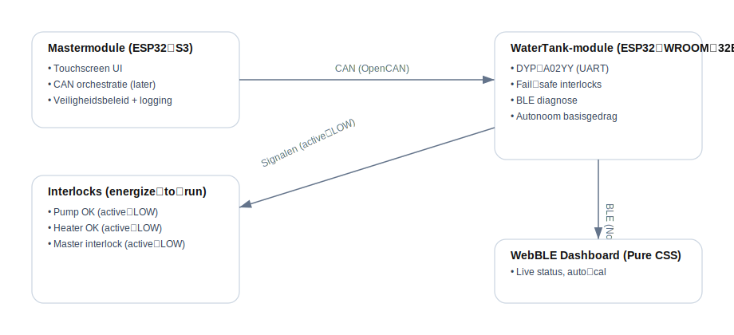
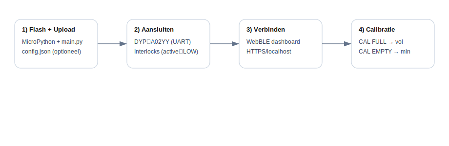

# Domobar Control System

Modulair digitaal besturingssysteem voor de **Vibiemme Domobar Standaard/Classic**.  
Decentrale kernbesturingsmodules (ESP32) communiceren via CAN (toekomstig) en bieden lokale veiligheid.  
Een mastermodule orkestreert het geheel en levert de UI. Voor WebBLE-diagnose is een **pure CSS** dashboard aanwezig.



## Belangrijkste kenmerken
1. **Veiligheid eerst** — fail-safe interlocks, energize-to-run (active-LOW), autonome safety per module.
2. **Robuustheid** — eenvoudige, testbare modules; filtering en hysterese tegen ruis/slosh.
3. **Onderhoudbaarheid** — duidelijke grenzen per module, BLE-diagnose, configuratie via `config.json`.
4. **Eenvoudig** — originele gebruikerservaring blijft leidend; nerd-features optioneel.
5. **Non-invasief** — respecteert machine; hardware-interlocks voor echte fail-safety.

## Repository-structuur (suggestie)
```
firmware/
  watertank_module/
    main.py         # Micropython code (ESP32-WROOM-32E)
    config.json     # Domobar-tuned defaults
web-dashboard/
  watertank_module/
    watertank_module_webble.html  # Pure CSS WebBLE
docs/
  system-overview.svg
  quickstart-flow.svg
  system-architecture.md
  domobar-specs.md
  calibration-guide.md
LICENSE
README.md
```

## Quick Start


1. **Flash** MicroPython op ESP32-WROOM-32E.
2. **Upload** `firmware/watertank_module/main.py` en optioneel `config.json`.
3. **Koppel** DYP-A02YY (UART) + interlock-relais (energize-to-run, active-LOW).
4. **Start** en **verbind** via het WebBLE-dashboard (`web-dashboard/watertank_module/watertank_module_webble.html`).
5. **Calibreer**: `CAL FULL` → tank vol; `CAL EMPTY` → minimaal niveau; check `CFG?`.

## Veiligheid
- Interlocks zijn **active-LOW** (0=run, 1=stop) en ontworpen als **energize-to-run (fail-safe)**.
- MCU-fout of reboot ⇒ standaard **safe-off**.
- Heater uit bij **LOW**; **alles uit** bij **BOTTOM**.

## WaterTank Module (ESP32-WROOM-32E)
- Sensor: **DYP-A02YY (UART)**, ~100 ms respons, blind zone ~30 mm.
- Filtering: median window + EMA (`window=5`, `ema_alpha=0.25`).
- Drempels: `low_pct=30`, `bottom_pct=10`, `hysteresis_pct=4`.
- Sample: `sample_hz=8`, timeout `1200 ms`.
- Kalibratie: `CAL FULL`/`CAL EMPTY` (waarden persist in `config.json`).

## Dashboards (Watertank_Module)
- **WebBLE** dashboard met:
  - Live `%` + status (OK/LOW/BOTTOM/FAULT) en kleurindicatie.
  - Inline **auto-calibratie** stappenpaneel (FULL → EMPTY).
  - Eventlog en `CFG?/INFO?` dump.
- Open in **HTTPS** context (of `http://localhost`).

## Media / Demo
- **GIF/Video** plaats hier later: `docs/demo-calibration.gif` (placeholder).
- **Foto’s** van montage en bedrading in `docs/images/` (optioneel).

## Licentie
MIT — zie `LICENSE`.

---

### Changelog (korte noot)
- Domobar-specifieke defaults in firmware (`min_mm=30`, `max_mm=220`, `low/bottom/hysteresis`, etc.).
- Dashboard: pure CSS; inline auto-calibratiepaneel toegevoegd.
